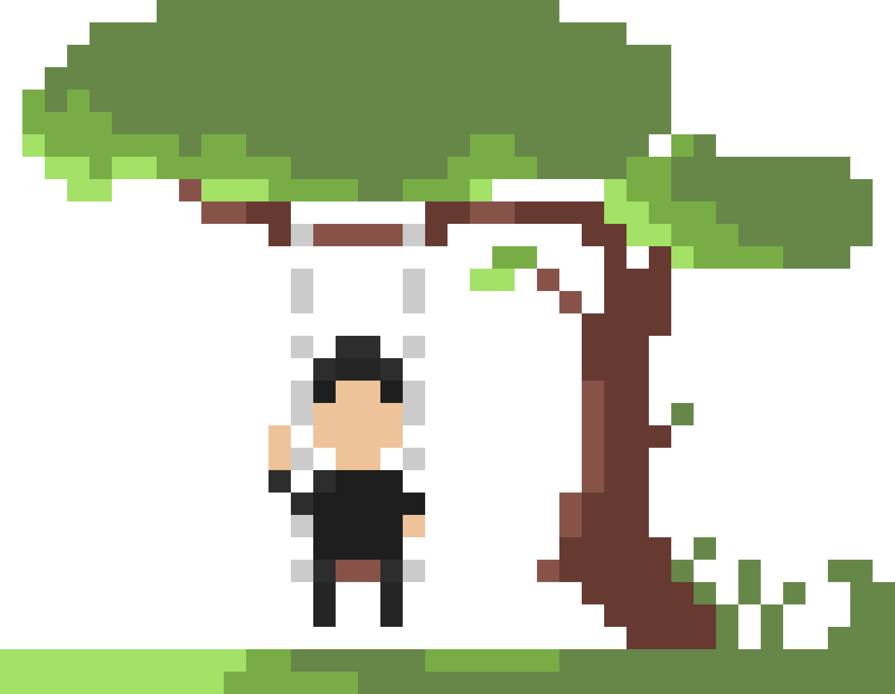

# Hiii, I'm Panda Soli 

I'm a freelancer   
I do **not** make design 🎨  
I'm studying low-level computing   
Now I'm focusing on knowledge and power   
I'm a BatchScript high level developer   
I speak
  , 
  , 
   and 
  

 
 

  

 

  

  ### Technologies I use 
  

  
  
  
  

  
  
  
    
  
  
  
  
  

  
  

  
  

  

 

  [→ see all the twemojis](https://github.com/pandasoli/twemojis)  
  [→ see my curricula](./public/curricula/)

[prim-cl]: 1f2630
[secon-cl]: 161b22
[font-cl]: c9d1d9

