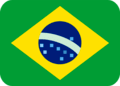

# Hiii, I'm Panda Soli 

I'm studying to be a JavaScript Fullstack developer.  
I have studied many ancient languages, but now I'm focusing on the future.  
[Help me to buy a better notebook for keep studying](https://vakinha.com.br/2982481)

  

### About me 

I'm a BatchScript high level developer   
I love to learn anything   
I like programming things with console interface   
Programming's my passion   
I love nature 

### Idioms I speak 

 Português brasileiro  
 American English  
 Español dominicano  
 Toki pona

