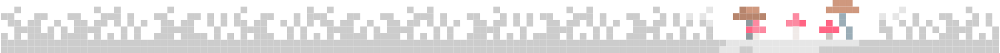

# <samp>Hey, I'm [Panda](https://github.com/pandasoli)!</samp>

 

Hello, I am **Panda Soli** (nickname), I'm currently studying low-level computing, but I'm also JS fullstack.

I appreciate open source projects, linux and CLI projects.

 
 

 
 

You can contact me on  

 

I enjoy creating libraries and tools for other devs  
BatchScript was my first language   
I use linux as main environment   
(Neo)Vim are my favorite editors

 
 
 
 

<!--
   -->

  

